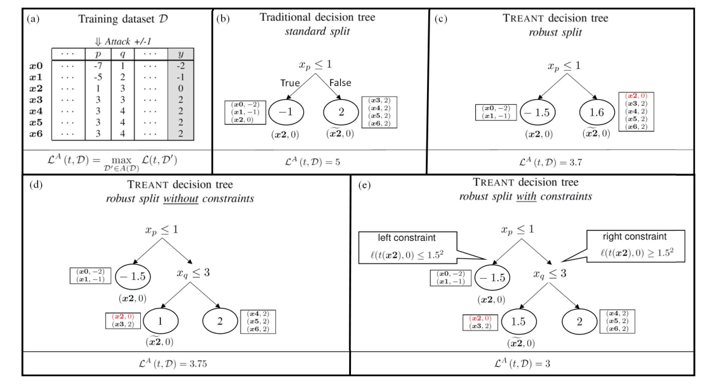

# TREANT

This repository contains the source code associated with the method proposed by Calzavara _et al._ in their ... research paper entitled "_TREANT: Training Evasion-Aware Decision Trees_" \[more information available at: [arXiv.org](https://arxiv.org/abs/1907.01197)\] 
The name [TREANT](https://en.wikipedia.org/wiki/Treant) comes from the "_Dungeons & Dragons_" roleplaying game, where it identifies giant tree-like fictional creatures. Overview of the Treant construction and its key challenges are depicted in the following figure

  

# Goal

Describe the goal of this project...

# Structure

Describe the structure of this project...

# Usage

Describe how to run the pipeline...

# Credit

If you use this implementation in your work, please add a reference/citation to our paper. You can use the following BibTeX entry:

